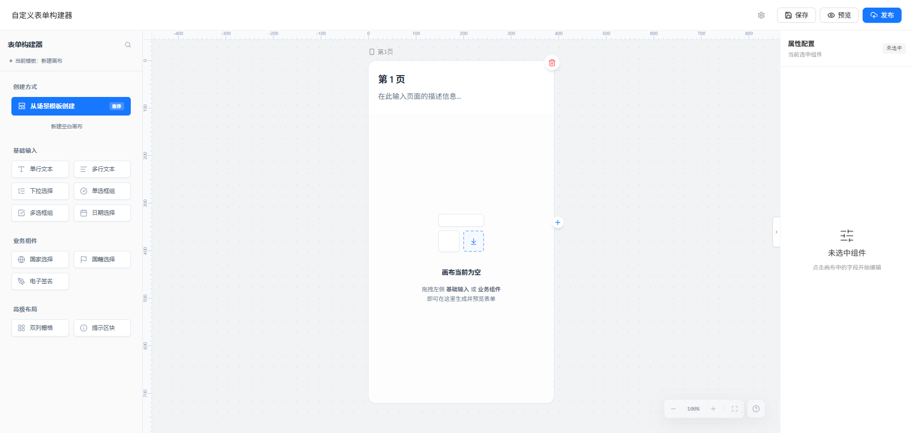
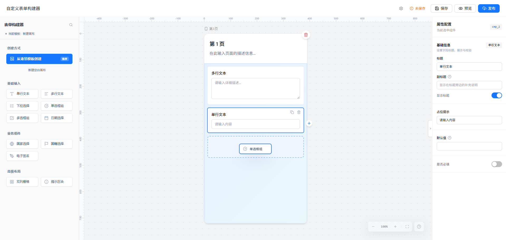
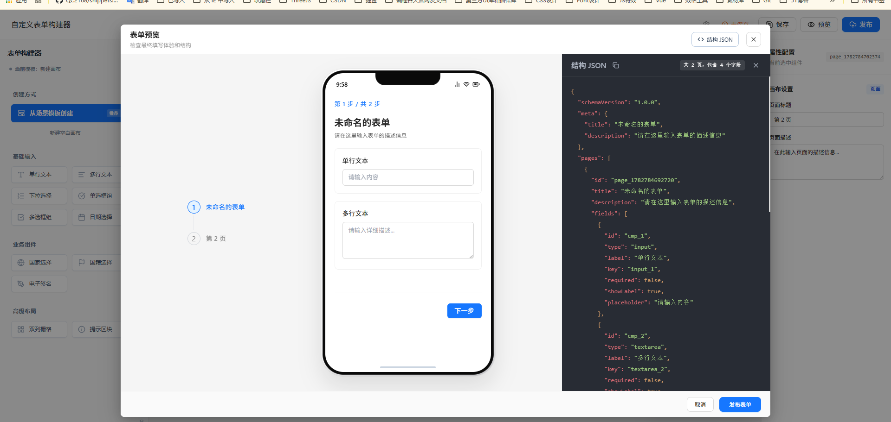

# AlgoCandy Low-Code Form Builder (低代码表单设计器)

这是一个基于原生 JavaScript（Vanilla JS）和 Tailwind CSS 构建的高性能、无依赖（除拖拽库和图标库外）的轻量级低代码表单搭建平台。旨在提供接近工业级的表单搭建体验，支持复杂的布局和高度定制化的组件结构。

效果演示：




## ✨ 核心特性

- **极致流畅的拖拽体验**：基于 `Sortable.js` 深度定制，支持组件拖拽、排序，以及**无限层级的栅格（Grid）嵌套**。
- **无极缩放与平移（Infinite Canvas）**：原生实现类似 Figma 的画布操控体验，支持按住空格键自由平移，滚轮自由缩放。
- **数据驱动架构**：采用单向数据流思想，左侧画布、中间视图与右侧属性面板**实时双向绑定**，任何改动都会瞬间同步至底层的 JSON Schema。
- **零依赖原生架构**：除了样式引擎（Tailwind）与核心拖拽插件，完全抛弃庞大的前端框架，直接操作 DOM，实现了极高的运行效率和极低的加载开销。
- **伪后台持久化（Mock API）**：内置基于 `Promise` 和 `localStorage` 的虚拟 API 服务，支持保存、读取、发布表单，刷新网页数据不丢失。
- **优雅的交互细节**：完美解决了 Sortable.js 在缩放状态下的“幽灵坐标偏移” Bug；支持组件与配置面板的“虚拟焦点高亮映射”。

## 📂 目录结构

项目采用了清晰的模块化分层架构：

```text
├── index.html            # 主界面的 UI 骨架及组件 <template> 库
├── app.css               # 全局样式及拖拽阴影、特效的覆盖
├── js/
│   ├── main.js           # 系统入口，统筹各模块初始化与全局事件总线
│   ├── core/
│   │   ├── state.js      # 全局状态树（存放当前选中的元素、页面、视图坐标等）
│   │   ├── schema.js     # 序列化/反序列化核心，负责画布与 JSON 之间的转换
│   │   └── api.js        # 模拟后端网络请求的服务层
│   ├── components/
│   │   ├── builder.js    # 负责克隆并组装真实 DOM 节点的工厂函数
│   │   └── registry.js   # 全局物料配置表（各组件的默认属性、配置项）
│   ├── ui/
│   │   ├── canvas.js     # 画布核心（容器接管、无限空间计算、拖放生命周期）
│   │   ├── properties.js # 属性面板监听器（表单联动更新）
│   │   └── preview.js    # 预览层与代码/JSON生成器
│   └── utils/
│       └── helpers.js    # 通用辅助函数（如防抖、图标渲染等）
```

## 🚀 快速启动

由于完全基于原生 JavaScript 编写，项目无需繁琐的 `npm install` 或是 Webpack/Vite 打包过程：

1. 克隆或下载本项目。
2. 使用任何本地静态服务器（如 VS Code 的 **Live Server** 插件，或 Python 的 `python -m http.server`）运行项目根目录。
3. 在浏览器中打开对应的本地端口（如 `http://localhost:5500`）即可使用。

*(注：由于使用了 ES Module 的 `import/export` 语法，必须通过 HTTP 协议启动，不能直接双击打开 `.html` 文件，否则浏览器会报跨域错误。)*

## 🛠 近期核心更新记录

- **API 隔离与模拟（Mock API）**：抽离了独立的 `api.js` 层，完美打通“发布”、“保存”逻辑。
- **自适应水位重置**：重构了 `loadSchema`，在加载不同模板或切换空白画布时，自动扫描并重置底层组件自增 ID，杜绝了组件 Key 漏算和冲突。
- **降维修复 Sortable.js 缩放偏移 Bug**：通过引入现代 CSS `scale` 属性与 `transform-origin` 结合，彻底根治了在缩放画布时拖拽影子偏移鼠标位置的世界级难题。

## 📖 技术原理解析

如果你对底层的具体实现原理（如 DOM 树到 JSON 树的转换、平移矩阵计算、拖拽引擎的重写）感兴趣，请参考项目根目录下的深度源码解析文章：[tech_blog.md](./tech_blog.md)。